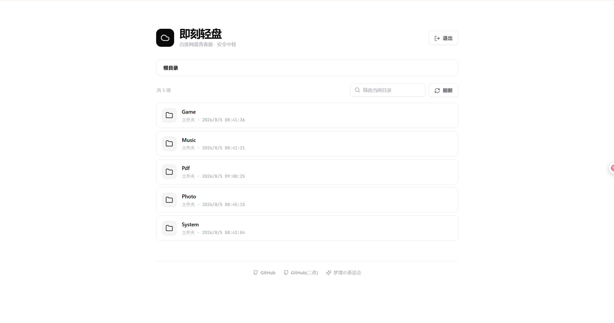

# 即刻轻盘

基于**百度网盘青春版**的临时中转网盘。

- 后端：Go（标准库，无第三方依赖）
- 前端：静态 HTML / CSS / JS（`go:embed` 打进二进制，无外部依赖与 CDN）
- Cookie 只保存在服务端，不暴露给浏览器
- **VPS 给少数人用**：配置 `access_token` 启用访问控制

## 功能

- 浏览网盘目录（支持文件夹、自动翻页合并）
- 申请不透明短链后下载（路径不出现在下载 URL）
- 复制短链分享（有效期内可重复访问；若开启访问控制，接收方也需先验证）
- 自动识别目录 README，并在文件列表上方安全渲染常用 Markdown
- 图片文件站内灯箱预览（支持常见图片格式，单张最大 16 MB）
- 登录会话用 HMAC 签名并内嵌过期时间，Cookie 不含令牌原文；可一键强制全员下线
- 登录失败按 IP 指数退避锁定，抵御令牌爆破
- 服务端限流、CSRF 保护、直链域名白名单
- 直链缓存按 User-Agent 绑定，避免跨浏览器复用失效
- 健康检查 `/healthz`、就绪检查 `/readyz`（需鉴权）

## 截图



## 快速开始

### 1. 准备配置

```bash
cp config.example.json config.json
```

编辑 `config.json`：至少填写 `baidu_cookie`；公网/VPS 务必设置 `access_token`。

```bash
# 生成访问令牌示例
openssl rand -hex 24
```

> Docker 容器内用环境变量 `BIND_ADDRESS=0.0.0.0` 覆盖监听地址即可。

完整字段说明见 [docs/configuration.md](docs/configuration.md)。

### 2. 运行

```bash
# 开发
go run . -config config.json

# 发布构建
bash build.sh
./cmd/bin/main -config config.json
```

Windows PowerShell：

```powershell
go run . -config config.json
# 或
go build -o cmd/bin/main.exe .
.\cmd/bin\main.exe -config config.json
```

浏览器访问：`http://127.0.0.1:4172`

### 3. Docker（可选）

```bash
cp config.example.json config.json   # 填好 cookie / token
docker compose up -d --build
curl -sS http://127.0.0.1:4172/healthz
```

详见 [docs/deployment.md](docs/deployment.md)。

## 文档索引

| 文档 | 内容 |
| --- | --- |
| [docs/configuration.md](docs/configuration.md) | 配置字段、环境变量 |
| [docs/deployment.md](docs/deployment.md) | Docker / VPS / 反向代理 |
| [docs/api.md](docs/api.md) | HTTP API 与下载流程 |
| [docs/security.md](docs/security.md) | 安全建议 |
| [docs/development.md](docs/development.md) | 项目结构、开发与测试 |

## 参考

定位下载签名逻辑参考了 [AList](https://github.com/AlistGo/alist) 的 BaiduYouth 驱动实现思路。

## 相关链接

- 开源仓库：<https://github.com/ekishion/jikeqingpan>
